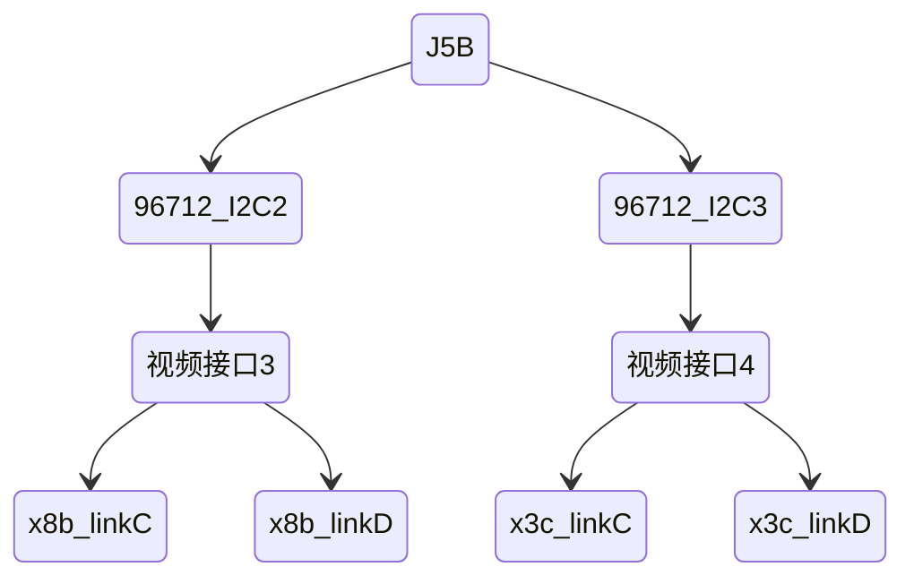
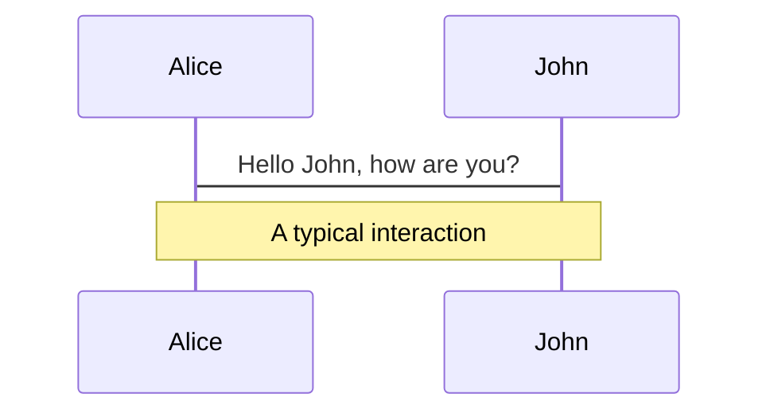
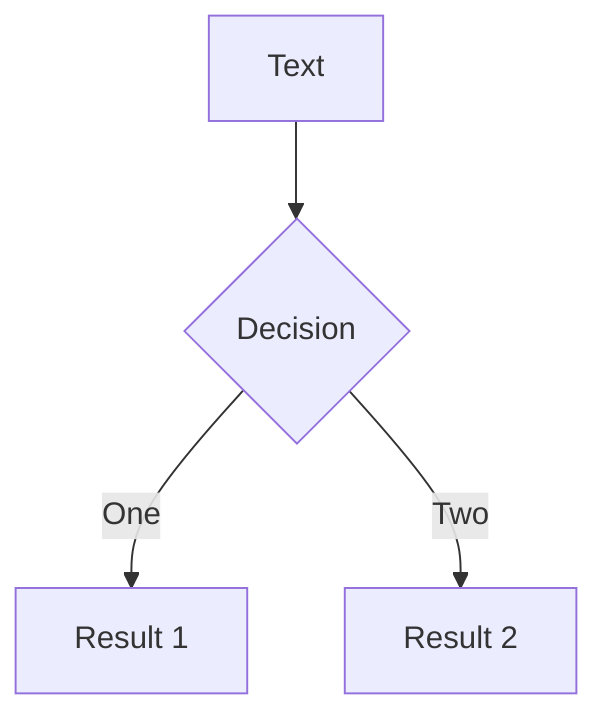
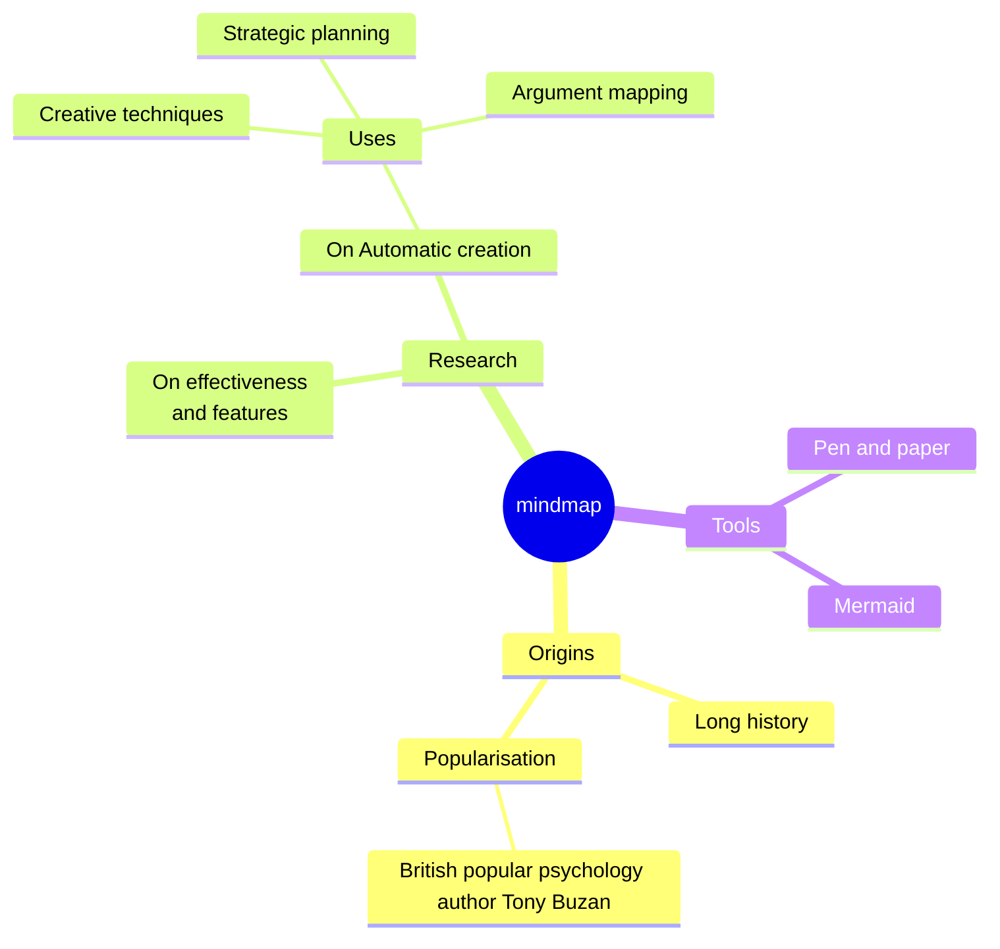
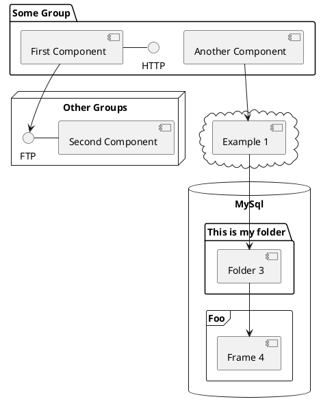

---
# try also 'default' to start simple
theme: seriph
# random image from a curated Unsplash collection by Anthony
# like them? see https://unsplash.com/collections/94734566/slidev
background: https://cover.sli.dev
# some information about your slides, markdown enabled
title: 一体化大板J5相机测试
info: |
  ## Slidev Starter Template
  Presentation slides for developers.

  Learn more at [Sli.dev](https://sli.dev)
# apply any unocss classes to the current slide
class: text-center
# https://sli.dev/custom/highlighters.html
highlighter: shiki
# https://sli.dev/guide/drawing
drawings:
  persist: false
# slide transition: https://sli.dev/guide/animations#slide-transitions
transition: slide-left
# enable MDC Syntax: https://sli.dev/guide/syntax#mdc-syntax
mdc: true
---

# 一体化大板J5相机测试

<div></div>

<div class="pt-12">
  <span @click="$slidev.nav.next" class="px-2 py-1 rounded cursor-pointer" hover="bg-white bg-opacity-10">
    点击这里到下一页 <carbon:arrow-right class="inline"/>
  </span>
</div>

<!--
The last comment block of each slide will be treated as slide notes. It will be visible and editable in Presenter Mode along with the slide. [Read more in the docs](https://sli.dev/guide/syntax.html#notes)
-->

---
layout: two-cols
layoutClass: gap-16
---

# 目录

一体化相机测试手册，供验证阶段使用

::right::

<Toc v-click minDepth="1" maxDepth="2"></Toc>

<!--
You can have `style` tag in markdown to override the style for the current page.
Learn more: https://sli.dev/guide/syntax#embedded-styles
-->

<style>
h1 {
  background-color: #2B90B6;
  background-image: linear-gradient(45deg, #4EC5D4 10%, #146b8c 20%);
  background-size: 100%;
  -webkit-background-clip: text;
  -moz-background-clip: text;
  -webkit-text-fill-color: transparent;
  -moz-text-fill-color: transparent;
}
</style>

<!--
Here is another comment.
-->

---
transition: slide-up
layout: center
class: text-center
level: 1
---

# 测试目的

在一体化的板子上，使用已配置好的驱动，点亮摄像头

---
transition: slide-up
layout: center
level: 1
---

# 功能要求

1. 点亮单颗摄像头
2. 点亮多颗摄像头
3. 同时点亮不同接口上的多颗摄像头
4. 相机帧同步

---
layout: two-cols
layoutClass: gap-4
---

# 结构框图


### J5A


::right::

<div mt-14></div>

### J5B



---
level: 1
---

# 原理图标注

一个视频接口的<span style="color:#45b046;font-weight:bold">线束1、2、3、4</span>对应<span style="color:#45b046;font-weight:bold">Link A、B、C、D</span>

接插件26J1为视频接口1，接插件26J2为视频接口2，接插件26J3为视频接口3，接插件26J4为视频接口4，硬件具体位置请根据具体位图查找

<div flex>


</div>

---
layout: image-right
image: https://cover.sli.dev
level: 2
---

# I2C总线

分别与J5A和J5B连接的<span text-green-600>解串器96712</span>的I2C总线均是<span bg-yellow-600>I2C2和I2C3</span>

<div mt-15></div>


<div mt-15></div>


---
transition: slide-up
level: 2
---

# 相机同步信号

一体化板子上相机同步信号是由FPGA给出

<div mt-1></div>


###### 对于任意一个96712来说有4个trigger与之对应，分别是MFP4、MFP6、MFP8、MFP10，驱动中任选其一

<div mt-3></div>


---
level: 1
---

## 驱动配置说明

<div grid="~ cols-2 gap-4">
<div>

x3c相机和x8b相机驱动文件在SDK中如下位置：


</div>
<div>
<div text-10px text-gray-600>
x3c相机驱动中打开了Link C、D，需要在对应视频接口的3、4线束上接入相机<br/>
x8b相机驱动中打开了Link C、D，需要在对应视频接口的3、4线束上接入相机
</div>
```c
0x04, 0x52, 0x00, 0x06, 0xF8,     // Link D
0x00, 0x32,
0x04, 0x80, 0x00, 0x00, 0x82,
0x04, 0x82, 0x00, 0x42, 0xC4,
0x04, 0x82, 0x00, 0x43, 0x82, //映射后ser_addr 41
0x04, 0x82, 0x00, 0x44, 0x22, //映射后sensor_addr 11
0x04, 0x82, 0x00, 0x45, 0x6C,
0x00, 0xff, 
0x00, 0xff,  // delay
0x04, 0x52, 0x00, 0x06, 0xF4,     // Link C
0x00, 0x32,
0x04, 0x80, 0x00, 0x00, 0x84,
0x04, 0x84, 0x00, 0x42, 0xC4,
0x04, 0x84, 0x00, 0x43, 0x84, //映射后ser_addr 42
0x04, 0x84, 0x00, 0x44, 0x24, //映射后sensor_addr 12
0x04, 0x84, 0x00, 0x45, 0x6C,

0x04, 0x52, 0x00, 0x06, 0xFC,   // Enable  C D Links in GMSL2 mode
0x00, 0xFF,
```

</div>
</div>

<style>
h2 {
  color: #5D8392;
}
</style>

---
level: 2
---

# 可能的问题
> <svg xmlns="http://www.w3.org/2000/svg" width="1.4em" height="1.4em" viewBox="0 0 24 24"><path fill="#895ae1" d="M1.5 4.25c0-.966.784-1.75 1.75-1.75h17.5c.966 0 1.75.784 1.75 1.75v12.5a1.75 1.75 0 0 1-1.75 1.75h-9.586a.25.25 0 0 0-.177.073l-3.5 3.5A1.458 1.458 0 0 1 5 21.043V18.5H3.25a1.75 1.75 0 0 1-1.75-1.75ZM3.25 4a.25.25 0 0 0-.25.25v12.5c0 .138.112.25.25.25h2.5a.75.75 0 0 1 .75.75v3.19l3.427-3.427A1.75 1.75 0 0 1 11.164 17h9.586a.25.25 0 0 0 .25-.25V4.25a.25.25 0 0 0-.25-.25ZM12 6a.75.75 0 0 1 .75.75v4a.75.75 0 0 1-1.5 0v-4A.75.75 0 0 1 12 6m0 9a1 1 0 1 1 0-2a1 1 0 0 1 0 2"/></svg><span style="color: #895AE1; font-weight:bold;">Important</span>
>
> 可能的问题：由于DPLL相关的寄存器写入在金脉控制器上，出现过问题（x8b接在rx0上的时候出现无法写入目标寄存器的错误，该寄存器在数据手册中查询不到，目前认为是可选项），如果测试有问题可以将寄存器中有关DPLL的部分注释后再使用，相关代码如下：

<div mt-5></div>


---
level: 2
---

# 相机同步配置

咱们选择使用96712的MFP4来处理同步信号，MFP4因为有现成的寄存器同步配置

```c
//MFP4
0x030D, 0xa7,  // pulldown,push-pull,id = 7
0x030E, 0x07,  // id = 7
0x030C, 0xeb,  // 1M,High prio,Jitter,output 0,GMSL2 tx
0x0344, 0xe7,  // linkB,High prio,Jitter,GMSL2 tx,id = 7
0x0345, 0x07,  // linkB,disable GMSL2 rx, id = 7
0x037A, 0xe7,  // linkC,High prio,Jitter,GMSL2 tx,id = 7
0x037B, 0x07,  // linkC,disable GMSL2 rx, id = 7
0x03B1, 0xe7,  // linkD,High prio,Jitter,GMSL2 tx,id = 7
0x03B2, 0x07,  // linkD,disable GMSL2 rx, id = 7
```

---
level: 1
---

# 物料准备

|     物料     | 点检 |
| :----------: | :--: |
| 一体化控制器 |      |
|     网线     |      |
|   相机线束   |      |
|  OX08BC相机  |      |
|  OX03CC相机  |      |
| 相机测试软件 |      |


---
level: 1
---

# 一颗x8b点亮

#### 测试方法：

- 使用单颗x8b出图的配置，需要一颗x8b接在I2C地址总线2的接口上，选择线束4
- 检查hb文件中cim_config.json路径是否正确

```json {all|3}
"deserial_index":0,
"deserial_port":0,
"data_path":"/userdata/j5-madc3.5-16v-sunny/config_j5a_rx0_rx1/yanqi_x8b/cim_config.json",
"config_path":"/system/etc/cam/hb_mipi_ovx8bntx_raw12_%dfps_%dP.json"
```

- 当前目录运行如下命令

```sh
mount /userdata/tmpsystem/ /system/
sync
./gpio.sh
config_generator test -p 1 -M 32 -h 1
```

- pc端运行出图软件hobotplayer，点击connect

---
level: 2
---

# 理论现象

1. 运行出图程序，有每一帧的输出信息
2. pc端可以正常查看到图像

---
layout: image-right
image: https://cover.sli.dev
---

# Code

Use code snippets and get the highlighting directly, and even types hover![^1]

```ts {all|5|7|7-8|10|all} twoslash
// TwoSlash enables TypeScript hover information
// and errors in markdown code blocks
// More at https://shiki.style/packages/twoslash

import { computed, ref } from 'vue'

const count = ref(0)
const doubled = computed(() => count.value * 2)

doubled.value = 2
```

<arrow v-click="[4, 5]" x1="350" y1="310" x2="195" y2="334" color="#953" width="2" arrowSize="1" />

<!-- This allow you to embed external code blocks -->
<<< @/snippets/external.ts#snippet

<!-- Footer -->
[^1]: [Learn More](https://sli.dev/guide/syntax.html#line-highlighting)

<!-- Inline style -->
<style>
.footnotes-sep {
  @apply mt-5 opacity-10;
}
.footnotes {
  @apply text-sm opacity-75;
}
.footnote-backref {
  display: none;
}
</style>

<!--
Notes can also sync with clicks

[click] This will be highlighted after the first click

[click] Highlighted with `count = ref(0)`

[click:3] Last click (skip two clicks)
-->

---
level: 2
---

# Shiki Magic Move

Powered by [shiki-magic-move](https://shiki-magic-move.netlify.app/), Slidev supports animations across multiple code snippets.

Add multiple code blocks and wrap them with <code>````md magic-move</code> (four backticks) to enable the magic move. For example:

````md magic-move {lines: true}
```ts {*|2|*}
// step 1
const author = reactive({
  name: 'John Doe',
  books: [
    'Vue 2 - Advanced Guide',
    'Vue 3 - Basic Guide',
    'Vue 4 - The Mystery'
  ]
})
```

```ts {*|1-2|3-4|3-4,8}
// step 2
export default {
  data() {
    return {
      author: {
        name: 'John Doe',
        books: [
          'Vue 2 - Advanced Guide',
          'Vue 3 - Basic Guide',
          'Vue 4 - The Mystery'
        ]
      }
    }
  }
}
```

```ts
// step 3
export default {
  data: () => ({
    author: {
      name: 'John Doe',
      books: [
        'Vue 2 - Advanced Guide',
        'Vue 3 - Basic Guide',
        'Vue 4 - The Mystery'
      ]
    }
  })
}
```

Non-code blocks are ignored.

```vue
<!-- step 4 -->
<script setup>
const author = {
  name: 'John Doe',
  books: [
    'Vue 2 - Advanced Guide',
    'Vue 3 - Basic Guide',
    'Vue 4 - The Mystery'
  ]
}
</script>
```
````

---

# Components

<div grid="~ cols-2 gap-4">
<div>

You can use Vue components directly inside your slides.

We have provided a few built-in components like `<Tweet/>` and `<Youtube/>` that you can use directly. And adding your custom components is also super easy.

```html
<Counter :count="10" />
```

<!-- ./components/Counter.vue -->
<Counter :count="10" m="t-4" />

Check out [the guides](https://sli.dev/builtin/components.html) for more.

</div>
<div>

```html
<Tweet id="1390115482657726468" />
```

<Tweet id="1390115482657726468" scale="0.65" />

</div>
</div>

<!--
Presenter note with **bold**, *italic*, and ~~striked~~ text.

Also, HTML elements are valid:
<div class="flex w-full">
  <span style="flex-grow: 1;">Left content</span>
  <span>Right content</span>
</div>
-->

---
class: px-20
---

# Themes

Slidev comes with powerful theming support. Themes can provide styles, layouts, components, or even configurations for tools. Switching between themes by just **one edit** in your frontmatter:

<div grid="~ cols-2 gap-2" m="t-2">

```yaml
---
theme: default
---
```

```yaml
---
theme: seriph
---
```


</div>

Read more about [How to use a theme](https://sli.dev/themes/use.html) and
check out the [Awesome Themes Gallery](https://sli.dev/themes/gallery.html).

---

# Clicks Animations

You can add `v-click` to elements to add a click animation.

<div v-click>

This shows up when you click the slide:

```html
<div v-click>This shows up when you click the slide.</div>
```

</div>

<br>

<v-click>

The <span v-mark.red="3"><code>v-mark</code> directive</span>
also allows you to add
<span v-mark.circle.orange="4">inline marks</span>
, powered by [Rough Notation](https://roughnotation.com/):

```html
<span v-mark.underline.orange>inline markers</span>
```

</v-click>

<div mt-20 v-click>

[Learn More](https://sli.dev/guide/animations#click-animations)

</div>

---

# Motions

Motion animations are powered by [@vueuse/motion](https://motion.vueuse.org/), triggered by `v-motion` directive.

```html
<div
  v-motion
  :initial="{ x: -80 }"
  :enter="{ x: 0 }"
  :click-3="{ x: 80 }"
  :leave="{ x: 1000 }"
>
  Slidev
</div>
```

<div class="w-60 relative">
  <div class="relative w-40 h-40">
    
    
    
  </div>

  <div
    class="text-5xl absolute top-14 left-40 text-[#2B90B6] -z-1"
    v-motion
    :initial="{ x: -80, opacity: 0}"
    :enter="{ x: 0, opacity: 1, transition: { delay: 2000, duration: 1000 } }">
    Slidev
  </div>
</div>

<!-- vue script setup scripts can be directly used in markdown, and will only affects current page -->
<script setup lang="ts">
const final = {
  x: 0,
  y: 0,
  rotate: 0,
  scale: 1,
  transition: {
    type: 'spring',
    damping: 10,
    stiffness: 20,
    mass: 2
  }
}
</script>

<div
  v-motion
  :initial="{ x:35, y: 30, opacity: 0}"
  :enter="{ y: 0, opacity: 1, transition: { delay: 3500 } }">

[Learn More](https://sli.dev/guide/animations.html#motion)

</div>

---

# LaTeX

LaTeX is supported out-of-box powered by [KaTeX](https://katex.org/).

<br>

Inline $\sqrt{3x-1}+(1+x)^2$

Block
$$ {1|3|all}
\begin{array}{c}

\nabla \times \vec{\mathbf{B}} -\, \frac1c\, \frac{\partial\vec{\mathbf{E}}}{\partial t} &
= \frac{4\pi}{c}\vec{\mathbf{j}}    \nabla \cdot \vec{\mathbf{E}} & = 4 \pi \rho \\

\nabla \times \vec{\mathbf{E}}\, +\, \frac1c\, \frac{\partial\vec{\mathbf{B}}}{\partial t} & = \vec{\mathbf{0}} \\

\nabla \cdot \vec{\mathbf{B}} & = 0

\end{array}
$$

<br>

[Learn more](https://sli.dev/guide/syntax#latex)

---

# Diagrams

You can create diagrams / graphs from textual descriptions, directly in your Markdown.

<div class="grid grid-cols-4 gap-5 pt-4 -mb-6">









</div>

[Learn More](https://sli.dev/guide/syntax.html#diagrams)

---
foo: bar
dragPos:
  square: 691,32,167,_,-16
---

# Draggable Elements

Double-click on the draggable elements to edit their positions.

<br>

###### Directive Usage

```md

```

<br>

###### Component Usage

```md
<v-drag text-3xl>
  <carbon:arrow-up />
  Use the `v-drag` component to have a draggable container!
</v-drag>
```

<v-drag pos="663,206,261,_,-15">
  <div text-center text-3xl border border-main rounded>
    Double-click me!
  </div>
</v-drag>


###### Draggable Arrow

```md
<v-drag-arrow two-way />
```

<v-drag-arrow pos="67,452,253,46" two-way op70 />

---
src: ./pages/multiple-entries.md
hide: false
---

---

# Monaco Editor

Slidev provides built-in Monaco Editor support.

Add `{monaco}` to the code block to turn it into an editor:

```ts {monaco}
import { ref } from 'vue'
import { emptyArray } from './external'

const arr = ref(emptyArray(10))
```

Use `{monaco-run}` to create an editor that can execute the code directly in the slide:

```ts {monaco-run}
import { version } from 'vue'
import { emptyArray, sayHello } from './external'

sayHello()
console.log(`vue ${version}`)
console.log(emptyArray<number>(10).reduce(fib => [...fib, fib.at(-1)! + fib.at(-2)!], [1, 1]))
```

---
layout: center
class: text-center
---

# Learn More

[Documentations](https://sli.dev) · [GitHub](https://github.com/slidevjs/slidev) · [Showcases](https://sli.dev/showcases.html)
