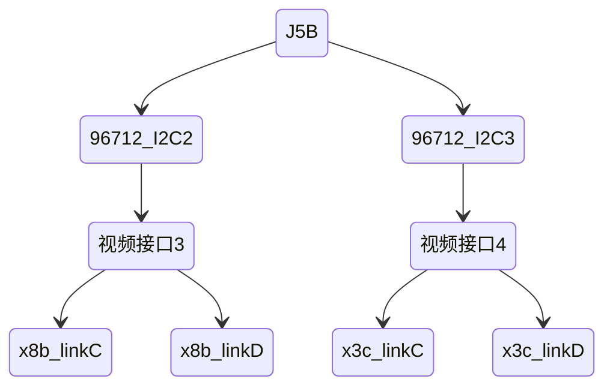

---
# try also 'default' to start simple
theme: seriph
# random image from a curated Unsplash collection by Anthony
# like them? see https://unsplash.com/collections/94734566/slidev
background: https://cover.sli.dev
# some information about your slides, markdown enabled
title: 一体化大板J5相机测试
info: |
  ## Slidev Starter Template
  Presentation slides for developers.

  Learn more at [Sli.dev](https://sli.dev)
# apply any unocss classes to the current slide
class: text-center
# https://sli.dev/custom/highlighters.html
highlighter: shiki
# https://sli.dev/guide/drawing
drawings:
  persist: false
# slide transition: https://sli.dev/guide/animations#slide-transitions
transition: slide-left
# enable MDC Syntax: https://sli.dev/guide/syntax#mdc-syntax
mdc: true
---

# 一体化大板J5相机测试

<div></div>

<div class="pt-12">
  <span @click="$slidev.nav.next" class="px-2 py-1 rounded cursor-pointer" hover="bg-white bg-opacity-10">
    点击这里到下一页 <carbon:arrow-right class="inline"/>
  </span>
</div>

<!--
The last comment block of each slide will be treated as slide notes. It will be visible and editable in Presenter Mode along with the slide. [Read more in the docs](https://sli.dev/guide/syntax.html#notes)
-->

---
layout: two-cols
layoutClass: gap-16
---

# 目录

一体化相机测试手册，供验证阶段使用

::right::

<Toc v-click minDepth="1" maxDepth="1"></Toc>

<!--
You can have `style` tag in markdown to override the style for the current page.
Learn more: https://sli.dev/guide/syntax#embedded-styles
-->

<style>
h1 {
  background-color: #2B90B6;
  background-image: linear-gradient(45deg, #4EC5D4 10%, #146b8c 20%);
  background-size: 100%;
  -webkit-background-clip: text;
  -moz-background-clip: text;
  -webkit-text-fill-color: transparent;
  -moz-text-fill-color: transparent;
}
</style>

<!--
Here is another comment.
-->

---
transition: slide-up
layout: center
class: text-center
level: 1
---

# 测试目的

在一体化的板子上，使用已配置好的驱动，点亮摄像头

---
transition: slide-up
layout: center
level: 1
---

# 功能要求

1. 点亮单颗摄像头
2. 点亮多颗摄像头
3. 同时点亮不同接口上的多颗摄像头
4. 相机帧同步

---
layout: two-cols
layoutClass: gap-4
---

# 结构框图


### J5A


::right::

<div mt-14></div>

### J5B



---
level: 1
---

# 原理图标注

一个视频接口的<span style="color:#45b046;font-weight:bold">线束1、2、3、4</span>对应<span style="color:#45b046;font-weight:bold">Link A、B、C、D</span>

接插件26J1为视频接口1，接插件26J2为视频接口2，接插件26J3为视频接口3，接插件26J4为视频接口4，硬件具体位置请根据具体位图查找

<div flex>


</div>

---
layout: image-right
image: https://cover.sli.dev
level: 2
---

# I2C总线

分别与J5A和J5B连接的<span text-green-600>解串器96712</span>的I2C总线均是<span bg-yellow-600>I2C2和I2C3</span>

<div mt-15></div>


<div mt-15></div>


---
transition: slide-up
level: 2
---

# 相机同步信号

一体化板子上相机同步信号是由FPGA给出

<div mt-1></div>


###### 对于任意一个96712来说有4个trigger与之对应，分别是MFP4、MFP6、MFP8、MFP10，驱动中任选其一

<div mt-3></div>


---
level: 1
---

# 驱动配置说明

<div grid="~ cols-2 gap-4">
<div>

x3c相机和x8b相机驱动文件在SDK中如下位置：


</div>
<div>
<div text-10px text-gray-600>
x3c相机驱动中打开了Link C、D，需要在对应视频接口的3、4线束上接入相机<br/>
x8b相机驱动中打开了Link C、D，需要在对应视频接口的3、4线束上接入相机
</div>
```c
0x04, 0x52, 0x00, 0x06, 0xF8,     // Link D
0x00, 0x32,
0x04, 0x80, 0x00, 0x00, 0x82,
0x04, 0x82, 0x00, 0x42, 0xC4,
0x04, 0x82, 0x00, 0x43, 0x82, //映射后ser_addr 41
0x04, 0x82, 0x00, 0x44, 0x22, //映射后sensor_addr 11
0x04, 0x82, 0x00, 0x45, 0x6C,
0x00, 0xff, 
0x00, 0xff,  // delay
0x04, 0x52, 0x00, 0x06, 0xF4,     // Link C
0x00, 0x32,
0x04, 0x80, 0x00, 0x00, 0x84,
0x04, 0x84, 0x00, 0x42, 0xC4,
0x04, 0x84, 0x00, 0x43, 0x84, //映射后ser_addr 42
0x04, 0x84, 0x00, 0x44, 0x24, //映射后sensor_addr 12
0x04, 0x84, 0x00, 0x45, 0x6C,

0x04, 0x52, 0x00, 0x06, 0xFC,   // Enable  C D Links in GMSL2 mode
0x00, 0xFF,
```

</div>
</div>

<style>
h2 {
  color: #5D8392;
}
</style>

---
level: 2
---

# 可能的问题
> <span style="color: #895AE1; font-weight:bold;">Important</span>
>
> 可能的问题：由于DPLL相关的寄存器写入在金脉控制器上，出现过问题（x8b接在rx0上的时候出现无法写入目标寄存器的错误，该寄存器在数据手册中查询不到，目前认为是可选项），如果测试有问题可以将寄存器中有关DPLL的部分注释后再使用，相关代码如下：

<div mt-5></div>


---
level: 2
---

# 相机同步配置

咱们选择使用96712的MFP4来处理同步信号，MFP4因为有现成的寄存器同步配置

```c
//MFP4
0x030D, 0xa7,  // pulldown,push-pull,id = 7
0x030E, 0x07,  // id = 7
0x030C, 0xeb,  // 1M,High prio,Jitter,output 0,GMSL2 tx
0x0344, 0xe7,  // linkB,High prio,Jitter,GMSL2 tx,id = 7
0x0345, 0x07,  // linkB,disable GMSL2 rx, id = 7
0x037A, 0xe7,  // linkC,High prio,Jitter,GMSL2 tx,id = 7
0x037B, 0x07,  // linkC,disable GMSL2 rx, id = 7
0x03B1, 0xe7,  // linkD,High prio,Jitter,GMSL2 tx,id = 7
0x03B2, 0x07,  // linkD,disable GMSL2 rx, id = 7
```

---
level: 1
---

# 物料准备

|     物料     | 点检 |
| :----------: | :--: |
| 一体化控制器 |      |
|     网线     |      |
|   相机线束   |      |
|  OX08BC相机  |      |
|  OX03CC相机  |      |
| 相机测试软件 |      |


---
level: 1
---

# 一颗x8b点亮

#### 测试方法：

- 使用单颗x8b出图的配置，需要一颗x8b接在I2C地址总线2的接口上，选择线束4
- 检查hb文件中cim_config.json路径是否正确

```json {all|3}
"deserial_index":0,
"deserial_port":0,
"data_path":"/userdata/j5-madc3.5-16v-sunny/config_j5a_rx0_rx1/yanqi_x8b/cim_config.json",
"config_path":"/system/etc/cam/hb_mipi_ovx8bntx_raw12_%dfps_%dP.json"
```

<div v-click>

- 当前目录运行如下命令

```sh
mount /userdata/tmpsystem/ /system/
sync
./gpio.sh
config_generator test -p 1 -M 32 -h 1
```

- pc端运行出图软件hobotplayer，点击connect
</div>

---
level: 2
---

# 理论现象

1. 运行出图程序，有每一帧的输出信息


2. pc端可以正常查看到图像


---
level: 1
---

# 一颗x3c点亮

#### 测试方法：

- 使用单颗x3c出图的配置，需要一颗x3c接在I2C地址总线2的接口上，选择线束4
- 检查hb文件中cim_config.json路径是否正确
- 当前目录运行如下命令

```sh
mount /userdata/tmpsystem/ /system/
sync
./gpio.sh
config_generator test -p 1 -M 16 -h 1
```

- pc端运行出图软件hobotplayer，点击connect


---
level: 1
---

# 两颗x8b点亮

- 使用两颗颗x8b出图的配置，需要两颗x8b接在I2C地址总线2的接口上，选择线束3，4
- 检查hb文件中cim_config.json路径是否正确
- 当前目录运行如下命令

```sh
mount /userdata/tmpsystem/ /system/
sync
./gpio.sh
config_generator test -p 2 -M 48 -h 2
```

- pc端运行出图软件hobotplayer，点击connect


---
level: 1
---

# 点亮不同类型相机

#### 测试方法：

- 使用四颗相机出图的配置，需要两颗x8b接在I2C地址总线2的接口上，选择线束3，4；需要两颗x3c接在I2C地址总线3的接口上，选择线束3，4
- 检查hb文件中cim_config.json路径是否正确
- 当前目录运行如下命令 

```sh
mount /userdata/tmpsystem/ /system/
sync
./gpio.sh
config_generator test -p 2 -M 54 -h 2
```

- pc端运行出图软件hobotplayer，点击connect


---
level: 1
---

# 相机帧同步

<div grid="~ cols-2 gap-4">
<div>
<span>前提要求：FPGA需给出相机帧同步信号</span><br/><br/>
<span text-orange-600 font-bold>需求</span>:

| **偏移量** | **1微秒**  |
| :--------: | :--------: |
|  **频率**  |  **30Hz**  |
| **占空比** | **10微秒** |

</div>
<div v-click >
<div text-10px text-gray-600>

##### 测试方法：

- 使用四颗相机同步的配置，需要两颗x8b接在I2C地址总线2的接口上，选择线束3，4；需要两颗x3c接在I2C地址总线3的接口上，选择线束3，4
- 检查hb文件中cim_config.json路径是否正确
- 当前目录运行如下命令 

```sh
mount /userdata/tmpsystem/ /system/
sync
./gpio.sh
config_generator test -p 2 -M 54 -h 2
```

- pc端运行出图软件hobotplayer，点击connect
</div>

<div text-10px text-gray-600>

##### 理论现象：

- 运行出图程序，有每一帧的输出信息，且相同pipe id的时间戳延时不超过3ms
- pc端可以正常查看到图像

</div>

</div>
</div>


---
level: 1
---

# 测试总结

| 序号 |  测试项目  | 实际现象 | 原因分析 | 修改记录 |
| :--: | ---- | :------: | :------: | :------: |
|  1   |  点亮一颗x8b  |          |          |          |
|  2   |  点亮一颗x3c  |          |          |          |
|  3   |  点亮两颗x8b  |          |          |          |
|  4   |  点亮不同类型相机  |          |          |          |
|  5   |  相机同步  |          |          |          |


