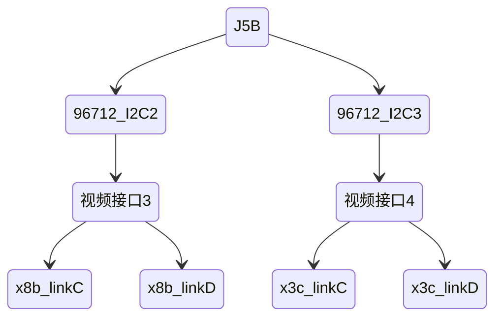

# 大板J5相机测试手册

## 一、测试目的

在一体化的板子上，使用已配置好的驱动，点亮摄像头

## 二、功能要求

1. 点亮单颗摄像头
2. 点亮多颗摄像头
3. 同时点亮不同接口上的多颗摄像头
4. 相机帧同步

## 三、配置检查

### 1）结构框图

#### J5A


#### J5B



### 2）原理图标注

一个视频接口的<span style="color:#45b046;font-weight:bold">线束1、2、3、4</span>对应<span style="color:#45b046;font-weight:bold">Link A、B、C、D</span>

接插件26J1为视频接口1，接插件26J2为视频接口2，硬件具体位置请根据具体位图查找：


接插件26J3为视频接口3，接插件26J4为视频接口4，硬件具体位置请根据具体位图查找：


与J5A和J5B连接的解串器96712的各自I2C总线是I2C2和I2C3：


相机同步信号是FPGA给出的


对于任意一个96712来说有4个trigger与之对应，分别是MFP4、MFP6、MFP8、MFP10，驱动中任选其一


### 3）驱动配置说明

x3c相机和x8b相机驱动文件在SDK中如下位置：


x3c相机驱动中打开了Link C、D，需要在对应视频接口的3、4线束上接入相机

x8b相机驱动中打开了Link C、D，需要在对应视频接口的3、4线束上接入相机

```c
0x04, 0x52, 0x00, 0x06, 0xF8,     // Link D
0x00, 0x32,
0x04, 0x80, 0x00, 0x00, 0x82,
0x04, 0x82, 0x00, 0x42, 0xC4,
0x04, 0x82, 0x00, 0x43, 0x82, //映射后ser_addr 41
0x04, 0x82, 0x00, 0x44, 0x22, //映射后sensor_addr 11
0x04, 0x82, 0x00, 0x45, 0x6C,
0x00, 0xff, 
0x00, 0xff,  // delay
0x04, 0x52, 0x00, 0x06, 0xF4,     // Link C
0x00, 0x32,
0x04, 0x80, 0x00, 0x00, 0x84,
0x04, 0x84, 0x00, 0x42, 0xC4,
0x04, 0x84, 0x00, 0x43, 0x84, //映射后ser_addr 42
0x04, 0x84, 0x00, 0x44, 0x24, //映射后sensor_addr 12
0x04, 0x84, 0x00, 0x45, 0x6C,

0x04, 0x52, 0x00, 0x06, 0xFC,   // Enable  C D Links in GMSL2 mode
0x00, 0xFF,
```


> <svg xmlns="http://www.w3.org/2000/svg" width="1.4em" height="1.4em" viewBox="0 0 24 24"><path fill="#895ae1" d="M1.5 4.25c0-.966.784-1.75 1.75-1.75h17.5c.966 0 1.75.784 1.75 1.75v12.5a1.75 1.75 0 0 1-1.75 1.75h-9.586a.25.25 0 0 0-.177.073l-3.5 3.5A1.458 1.458 0 0 1 5 21.043V18.5H3.25a1.75 1.75 0 0 1-1.75-1.75ZM3.25 4a.25.25 0 0 0-.25.25v12.5c0 .138.112.25.25.25h2.5a.75.75 0 0 1 .75.75v3.19l3.427-3.427A1.75 1.75 0 0 1 11.164 17h9.586a.25.25 0 0 0 .25-.25V4.25a.25.25 0 0 0-.25-.25ZM12 6a.75.75 0 0 1 .75.75v4a.75.75 0 0 1-1.5 0v-4A.75.75 0 0 1 12 6m0 9a1 1 0 1 1 0-2a1 1 0 0 1 0 2"/></svg><span style="color: #895AE1; font-weight:bold;">Important</span>
>
> 可能的问题：由于DPLL相关的寄存器写入在金脉控制器上，出现过问题（x8b接在rx0上的时候出现无法写入目标寄存器的错误，该寄存器在数据手册中查询不到，目前认为是可选项），如果测试有问题可以将寄存器中有关DPLL的部分注释后再使用，相关代码如下：


<span style="font-size: 20px;font-weight:600;">`相机同步配置`</span>

咱们选择使用96712的MFP4来处理同步信号，MFP4因为有现成的寄存器同步配置


## 四、测试准备

|     物料     | 点检 |
| :----------: | :--: |
| 一体化控制器 |      |
|     网线     |      |
|   相机线束   |      |
|  OX08BC相机  |      |
|  OX03CC相机  |      |
| 相机测试软件 |      |

## 五、测试条目

### 1）点亮一个x8b

#### 测试方法：

- 使用单颗x8b出图的配置，需要一颗x8b接在I2C地址总线2的接口上，选择线束4
- 检查hb文件中cim_config.json路径是否正确


- 当前目录运行如下命令

```sh
mount /userdata/tmpsystem/ /system/
sync
./gpio.sh
config_generator test -p 1 -M 32 -h 1
```

- pc端运行出图软件hobotplayer，点击connect


#### 理论现象：

- 运行出图程序，有每一帧的输出信息


- pc端可以正常查看到图像


#### 测试记录：

| 序号 | 实际现象 | 原因分析 | 修改记录 |
| :--: | :------: | :------: | :------: |
|  1   |          |          |          |

### 2）点亮一颗x3c

#### 测试方法：

- 使用单颗x3c出图的配置，需要一颗x3c接在I2C地址总线2的接口上，选择线束4
- 检查hb文件中cim_config.json路径是否正确
- 当前目录运行如下命令

```sh
mount /userdata/tmpsystem/ /system/
sync
./gpio.sh
config_generator test -p 1 -M 16 -h 1
```

- pc端运行出图软件hobotplayer，点击connect

#### 理论现象：

- 运行出图程序，有每一帧的输出信息
- pc端可以正常查看到图像

#### 测试记录：

| 序号 | 实际现象 | 原因分析 | 修改记录 |
| :--: | :------: | :------: | :------: |
|  1   |          |          |          |

### 3）点亮两颗x8b

#### 测试方法：

- 使用两颗颗x8b出图的配置，需要两颗x8b接在I2C地址总线2的接口上，选择线束3，4
- 检查hb文件中cim_config.json路径是否正确
- 当前目录运行如下命令

```sh
mount /userdata/tmpsystem/ /system/
sync
./gpio.sh
config_generator test -p 2 -M 48 -h 2
```

- pc端运行出图软件hobotplayer，点击connect

#### 理论现象：

- 运行出图程序，有每一帧的输出信息
- pc端可以正常查看到图像

#### 测试记录：

| 序号 | 实际现象 | 原因分析 | 修改记录 |
| :--: | :------: | :------: | :------: |
|  1   |          |          |          |

### 4）点亮多颗相机

#### 测试方法：

- 使用四颗相机出图的配置，需要两颗x8b接在I2C地址总线2的接口上，选择线束3，4；需要两颗x3c接在I2C地址总线3的接口上，选择线束3，4
- 检查hb文件中cim_config.json路径是否正确
- 当前目录运行如下命令 

```sh
mount /userdata/tmpsystem/ /system/
sync
./gpio.sh
config_generator test -p 2 -M 54 -h 2
```

- pc端运行出图软件hobotplayer，点击connect

#### 理论现象：

- 运行出图程序，有每一帧的输出信息
- pc端可以正常查看到图像

#### 测试记录：

| 序号 | 实际现象 | 原因分析 | 修改记录 |
| :--: | :------: | :------: | :------: |
|  1   |          |          |          |

### 5）相机帧同步

<span style="font-weight:bold; color:#1079da">前提要求：FPGA需给出相机帧同步信号</span>

<span style="color: #ffb700;font-weight:bold">需求：</span>

|   偏移量   |   1微秒    |
| :--------: | :--------: |
|  **频率**  |  **30Hz**  |
| **占空比** | **10微秒** |

#### 测试方法：

- 使用四颗相机同步的配置，需要两颗x8b接在I2C地址总线2的接口上，选择线束3，4；需要两颗x3c接在I2C地址总线3的接口上，选择线束3，4
- 检查hb文件中cim_config.json路径是否正确
- 当前目录运行如下命令 

```sh
mount /userdata/tmpsystem/ /system/
sync
./gpio.sh
config_generator test -p 2 -M 54 -h 2
```

- pc端运行出图软件hobotplayer，点击connect

#### 理论现象：

- 运行出图程序，有每一帧的输出信息，且相同pipe id的时间戳延时不超过3ms
- pc端可以正常查看到图像

#### 测试记录：

| 序号 | 实际现象 | 原因分析 | 修改记录 |
| :--: | :------: | :------: | :------: |
|  1   |          |          |          |

## 六、测试总结

- [ ] 点亮一颗x8b

- [ ] 点亮一颗x3c

- [ ] 点亮两颗x3c

- [ ] 点亮多颗相机

- [ ] 相机帧同步

